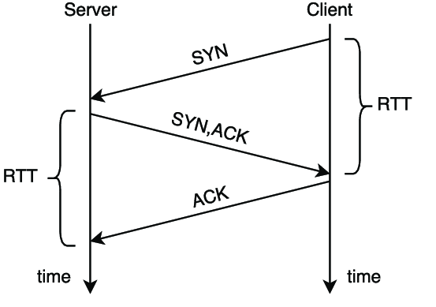
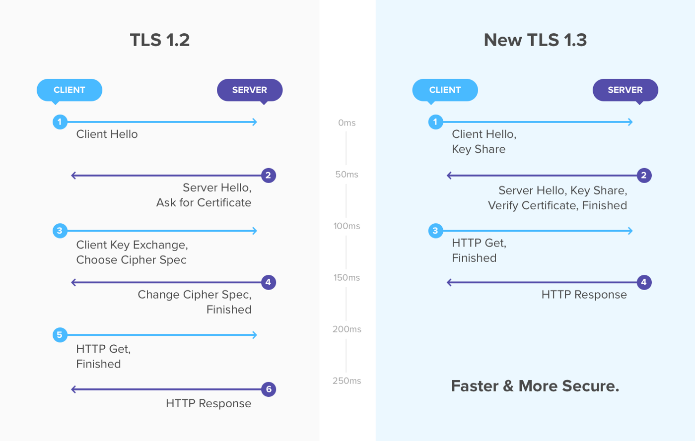

### HTTP3 and RTT

`i made an presentation serveral years ago, here to reorganize it`

|      | HTTP  | HTTPS 1.2 首次连接  | HTTPS 1.2 连接复用  |HTTPS 1.3 首次连接  | HTTPS 1.3 连接复用  |HTTP over QUIC首次连接  |HTTP over QUIC  连接复用|
|  ----  | ---- |----  |----  |----  |----  |----  |----  |
| TCP握手  | 1.5RTT |1.5RTT |0 RTT |1.5RTT |0 RTT | - | - |
| TLS握手  | - |2RTT |1RTT |1RTT |0RTT |- | -|
| QUIC握手  | - |  - | - | - | - | 1RTT | 0RTT |
| HTTP请求&响应  | 1RTT | 1RTT | 1RTT | 1RTT | 1RTT | 1RTT | 1RTT |
| 合计  | 2.5RTT |4.5RTT |2RTT |3.5RTT |1RTT |2RTT |1RTT|

### http/3 RTT的斗争史
##### 什么是RTT
RTT是Round Trip Time的缩写，通俗地说，就是通信一来一回的时间。

- 一次HTTP循环的时间

那么一次TCP建立连接时的握手，一共需要 1.5RTT

而对于一个HTTP请求&响应，加上HTTP Request&Response，算作一个1RTT。

那么基于TCP的的HTTP的消耗时间总和，就是 1.5RTT + 1RTT = 2.5RTT

- 安全加密通信
在TLS中过，一个HTTP循环需要多少RTT？

- TLS1.2
  - clientHello  
  - ServerHello
  - 验证后发送Client Key Exchange, Change Cipher Spec
  - 服务端Change Cipher Spec

因此对于采用tls1.2的HTTP连接，所需要 1.5RTT + 1RTT + 2RTT = 4.5RTT

//- TLS1.3

- HTTP 1.x
在HTTP1.x中，每个连接相互独立，因而每一个HTTP请求都需要3.5RTT。最终结果视请求量正比增长。

- HTTP 2
复用TLS连接，第一个之后的每一个HTTP可以减少1.5RTT + 2RTT = 3.5 RTT时间
问题： 头部阻塞

多路复用允许同时通过单一的 HTTP/2 连接发起多重的请求-响应消息。即连接共享，即每一个 request 都是是用作连接共享机制的。一个 request 对应一个 id，这样一个连接上可以有多个 request，每个连接的 request 可以随机的混杂在一起，接收方可以根据 request 的 id 将 request 再归属到各自不同的服务端请求里面

HTTP1.x 的 header 带有大量信息，而且每次都要重复发送，HTTP/2 使用 encoder 来减少需要传输的 header 大小，通讯双方各自cache 一份 header fields 表，既避免了重复 header 的传输，又减小了需要传输的大小。
为了减少这块的资源消耗并提升性能， HTTP/2 对这些首部采取了压缩策略：

链接耗时更短
拥塞控制更出色
更好的多路复用
前向纠错特性
链接迁移特性
